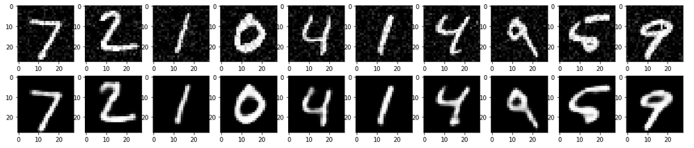
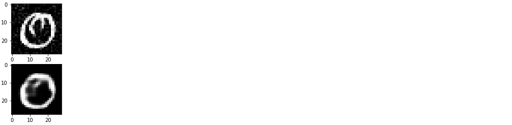

# CAE
In this notebook I've used Convolutional Autoencoders to denoise image MNIST data, as well as used simple CNN for classification.

Firstly the noise has been added to the image data and then it has been reconstructed by using CAE.
CNN achieved the accuracy of 0,99.

The image data from MNIST before and after adding the noise looks as shown below

The architecture of Convolutional Autoencoders look like shown below. It contains encoder and decoder parts with 3 convolutional layers per each.

DOI of the paper where the image was published 10.1007/978-3-319-70096-0_39

After applying CAE to MNIST data we get well recovered/denoised images,which is shown below

After calculating the mean-square error we find the image which has been recovered the worst and even in such case we can clearly distinguish the digit on the image, which we demonstrate it below

